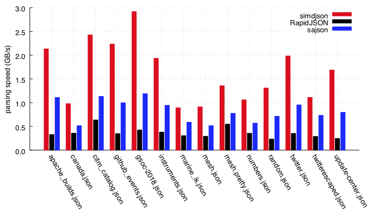
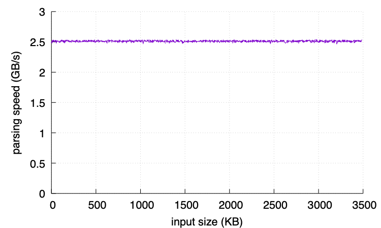

[](https://bugs.chromium.org/p/oss-fuzz/issues/list?sort=-opened&q=proj%3Asimdjson&can=2)
/badge.svg)
[/badge.svg)](https://simdjson.org/plots.html)


[![][license img]][license]  [](https://simdjson.org/api/0.5.0/index.html)

simdjson : Parsing gigabytes of JSON per second
===============================================


JSON is everywhere on the Internet. Servers spend a *lot* of time parsing it. We need a fresh
approach. The simdjson library uses commonly available SIMD instructions and microparallel algorithms
to parse JSON 2.5x faster than anything else out there.

* **Fast:** Over 2.5x faster than other production-grade JSON parsers.
* **Easy:** First-class, easy to use API.
* **Strict:** Full JSON and UTF-8 validation, lossless parsing. Performance with no compromises.
* **Automatic:** Selects a CPU-tailored parser at runtime. No configuration needed.
* **Reliable:** From memory allocation to error handling, simdjson's design avoids surprises.

This library is part of the [Awesome Modern C++](https://awesomecpp.com) list.

Table of Contents
-----------------

* [Quick Start](#quick-start)
* [Documentation](#documentation)
* [Performance results](#performance-results)
* [Real-world usage](#real-world-usage)
* [Bindings and Ports of simdjson](#bindings-and-ports-of-simdjson)
* [About simdjson](#about-simdjson)
* [Funding](#funding)
* [Contributing to simdjson](#contributing-to-simdjson)
* [License](#license)

Quick Start
-----------

          
The simdjson library is easily consumable with a single .h and .cpp file.

0. Prerequisites: `g++` (version 7 or better) or `clang++` (version 6 or better), and a 64-bit system with a command-line shell (e.g., Linux, macOS, freeBSD). We also support programming environnements like Visual Studio and Xcode, but different steps are needed.
1. Pull [simdjson.h](singleheader/simdjson.h) and [simdjson.cpp](singleheader/simdjson.cpp) into a directory, along with the sample file [twitter.json](jsonexamples/twitter.json).
   ```
   wget https://raw.githubusercontent.com/simdjson/simdjson/master/singleheader/simdjson.h https://raw.githubusercontent.com/simdjson/simdjson/master/singleheader/simdjson.cpp https://raw.githubusercontent.com/simdjson/simdjson/master/jsonexamples/twitter.json
   ```
2. Create `quickstart.cpp`:

   ```c++
   #include "simdjson.h"
   int main(void) {
     simdjson::dom::parser parser;
     simdjson::dom::element tweets = parser.load("twitter.json");
     std::cout << tweets["search_metadata"]["count"] << " results." << std::endl;
   }
   ```
3. `c++ -o quickstart quickstart.cpp simdjson.cpp`
4. `./quickstart`
   ```
   100 results.
   ```

Documentation
-------------

Usage documentation is available:

* [Basics](doc/basics.md) is an overview of how to use simdjson and its APIs.
* [Performance](doc/performance.md) shows some more advanced scenarios and how to tune for them.
* [Implementation Selection](doc/implementation-selection.md) describes runtime CPU detection and
  how you can work with it.
* [API](https://simdjson.org/api/0.5.0/annotated.html) contains the automatically generated API documentation.

Performance results
-------------------

The simdjson library uses three-quarters less instructions than state-of-the-art parser [RapidJSON](https://rapidjson.org) and
fifty percent less than sajson. To our knowledge, simdjson is the first fully-validating JSON parser
to run at [gigabytes per second](https://en.wikipedia.org/wiki/Gigabyte) (GB/s) on commodity processors. It can parse millions of JSON documents per second on a single core.

The following figure represents parsing speed in GB/s for parsing various files
on an Intel Skylake processor (3.4 GHz) using the GNU GCC 9 compiler (with the -O3 flag).
We compare against the best and fastest C++ libraries.
The simdjson library offers full unicode ([UTF-8](https://en.wikipedia.org/wiki/UTF-8)) validation and exact
number parsing. The RapidJSON library is tested in two modes: fast and
exact number parsing. The sajson library offers fast (but not exact)
number parsing and partial unicode validation. In this data set, the file
sizes range from 65KB (github_events) all the way to 3.3GB (gsoc-2018).
Many files are mostly made of numbers: canada, mesh.pretty, mesh, random
and numbers: in such instances, we see lower JSON parsing speeds due to the
high cost of number parsing. The simdjson library uses exact number parsing which
is particular taxing.



On a Skylake processor, the parsing speeds (in GB/s) of various processors on the twitter.json file are as follows, using again GNU GCC 9.1 (with the -O3 flag). The popular JSON for Modern C++ library is particularly slow: it obviously trades parsing speed for other desirable features.

| parser                                | GB/s |
| ------------------------------------- | ---- |
| simdjson                              | 2.5  |
| RapidJSON UTF8-validation             | 0.29 |
| RapidJSON UTF8-valid., exact numbers  | 0.28 |
| RapidJSON insitu, UTF8-validation     | 0.41 |
| RapidJSON insitu, UTF8-valid., exact  | 0.39 |
| sajson (insitu, dynamic)              | 0.62 |
| sajson (insitu, static)               | 0.88 |
| dropbox                               | 0.13 |
| fastjson                              | 0.27 |
| gason                                 | 0.59 |
| ultrajson                             | 0.34 |
| jsmn                                  | 0.25 |
| cJSON                                 | 0.31 |
| JSON for Modern C++ (nlohmann/json)   | 0.11 |


The simdjson library offers high speed whether it processes tiny files (e.g., 300 bytes)
or larger files (e.g., 3MB). The following plot presents parsing
speed for [synthetic files over various sizes generated with a script](https://github.com/simdjson/simdjson_experiments_vldb2019/blob/master/experiments/growing/gen.py) on a 3.4 GHz Skylake processor (GNU GCC 9, -O3).



[All our experiments are reproducible](https://github.com/simdjson/simdjson_experiments_vldb2019).

Real-world usage
----------------

- [Microsoft FishStore](https://github.com/microsoft/FishStore)
- [Yandex ClickHouse](https://github.com/yandex/ClickHouse)
- [Clang Build Analyzer](https://github.com/aras-p/ClangBuildAnalyzer)
- [Shopify HeapProfiler](https://github.com/Shopify/heap-profiler)

If you are planning to use simdjson in a product, please work from one of our releases.

Bindings and Ports of simdjson
------------------------------

We distinguish between "bindings" (which just wrap the C++ code) and a port to another programming language (which reimplements everything).

- [ZippyJSON](https://github.com/michaeleisel/zippyjson): Swift bindings for the simdjson project.
- [libpy_simdjson](https://github.com/gerrymanoim/libpy_simdjson/): high-speed Python bindings for simdjson using [libpy](https://github.com/quantopian/libpy).
- [pysimdjson](https://github.com/TkTech/pysimdjson): Python bindings for the simdjson project.
- [simdjson-rs](https://github.com/simd-lite): Rust port.
- [simdjson-rust](https://github.com/SunDoge/simdjson-rust): Rust wrapper (bindings).
- [SimdJsonSharp](https://github.com/EgorBo/SimdJsonSharp): C# version for .NET Core (bindings and full port).
- [simdjson_nodejs](https://github.com/luizperes/simdjson_nodejs): Node.js bindings for the simdjson project.
- [simdjson_php](https://github.com/crazyxman/simdjson_php): PHP bindings for the simdjson project.
- [simdjson_ruby](https://github.com/saka1/simdjson_ruby): Ruby bindings for the simdjson project.
- [fast_jsonparser](https://github.com/anilmaurya/fast_jsonparser): Ruby bindings for the simdjson project.
- [simdjson-go](https://github.com/minio/simdjson-go): Go port using Golang assembly.
- [rcppsimdjson](https://github.com/eddelbuettel/rcppsimdjson): R bindings.

About simdjson
--------------

The simdjson library takes advantage of modern microarchitectures, parallelizing with SIMD vector
instructions, reducing branch misprediction, and reducing data dependency to take advantage of each
CPU's multiple execution cores.

Some people [enjoy reading our paper](https://arxiv.org/abs/1902.08318): A description of the design
and implementation of simdjson is in our research article: Geoff Langdale, Daniel
Lemire, [Parsing Gigabytes of JSON per Second](https://arxiv.org/abs/1902.08318), VLDB Journal 28 (6), 2019.

We also have an informal [blog post providing some background and context](https://branchfree.org/2019/02/25/paper-parsing-gigabytes-of-json-per-second/).

For the video inclined, <br />
[](http://www.youtube.com/watch?v=wlvKAT7SZIQ)<br />
(it was the best voted talk, we're kinda proud of it).

Funding
-------

The work is supported by the Natural Sciences and Engineering Research Council of Canada under grant
number RGPIN-2017-03910.

[license]: LICENSE
[license img]: https://img.shields.io/badge/License-Apache%202-blue.svg

Contributing to simdjson
------------------------

Head over to [CONTRIBUTING.md](CONTRIBUTING.md) for information on contributing to simdjson, and
[HACKING.md](HACKING.md) for information on source, building, and architecture/design.

License
-------

This code is made available under the [Apache License 2.0](https://www.apache.org/licenses/LICENSE-2.0.html).

Under Windows, we build some tools using the windows/dirent_portable.h file (which is outside our library code): it under the liberal (business-friendly) MIT license.

For compilers that do not support [C++17](https://en.wikipedia.org/wiki/C%2B%2B17), we bundle the string-view library which is published under the Boost license (http://www.boost.org/LICENSE_1_0.txt). Like the Apache license, the Boost license is a permissive license allowing commercial redistribution.
