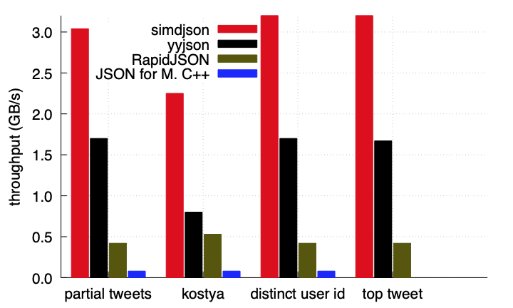

[/badge.svg)](https://simdjson.org/plots.html)
[](https://bugs.chromium.org/p/oss-fuzz/issues/list?sort=-opened&can=1&q=proj:simdjson)
[![][license img]][license]

[](https://simdjson.github.io/simdjson/)

simdjson : Parsing gigabytes of JSON per second
===============================================


JSON is everywhere on the Internet. Servers spend a *lot* of time parsing it. We need a fresh
approach. The simdjson library uses commonly available SIMD instructions and microparallel algorithms
to parse JSON 4x  faster than RapidJSON and 25x faster than JSON for Modern C++.

* **Fast:** Over 4x faster than commonly used production-grade JSON parsers.
* **Record Breaking Features:** Minify JSON  at 6 GB/s, validate UTF-8  at 13 GB/s,  NDJSON at 3.5 GB/s.
* **Easy:** First-class, easy to use and carefully documented APIs.
* **Strict:** Full JSON and UTF-8 validation, lossless parsing. Performance with no compromises.
* **Automatic:** Selects a CPU-tailored parser at runtime. No configuration needed.
* **Reliable:** From memory allocation to error handling, simdjson's design avoids surprises.
* **Peer Reviewed:** Our research appears in venues like VLDB Journal, Software: Practice and Experience.

This library is part of the [Awesome Modern C++](https://awesomecpp.com) list.

Table of Contents
-----------------

* [Real-world usage](#real-world-usage)
* [Quick Start](#quick-start)
* [Documentation](#documentation)
* [Performance results](#performance-results)
* [Bindings and Ports of simdjson](#bindings-and-ports-of-simdjson)
* [About simdjson](#about-simdjson)
* [Funding](#funding)
* [Contributing to simdjson](#contributing-to-simdjson)
* [License](#license)


Real-world usage
----------------

- [Node.js](https://nodejs.org/)
- [ClickHouse](https://github.com/ClickHouse/ClickHouse)
- [Meta Velox](https://velox-lib.io)
- [Google Pax](https://github.com/google/paxml)
- [milvus](https://github.com/milvus-io/milvus)
- [Clang Build Analyzer](https://github.com/aras-p/ClangBuildAnalyzer)
- [Shopify HeapProfiler](https://github.com/Shopify/heap-profiler)
- [StarRocks](https://github.com/StarRocks/starrocks)
- [Microsoft FishStore](https://github.com/microsoft/FishStore)
- [Intel PCM](https://github.com/intel/pcm)
- [WatermelonDB](https://github.com/Nozbe/WatermelonDB)
- [Apache Doris](https://github.com/apache/doris)
- [Dgraph](https://github.com/dgraph-io/dgraph)
- [UJRPC](https://github.com/unum-cloud/ujrpc)
- [fastgltf](https://github.com/spnda/fastgltf)
- [vast](https://github.com/tenzir/vast)
- [ada-url](https://github.com/ada-url/ada)
- [fastgron](https://github.com/adamritter/fastgron)

If you are planning to use simdjson in a product, please work from one of our releases.

Quick Start
-----------

The simdjson library is easily consumable with a single .h and .cpp file.

0. Prerequisites: `g++` (version 7 or better) or `clang++` (version 6 or better), and a 64-bit
   system with a command-line shell (e.g., Linux, macOS, freeBSD). We also support programming
   environments like Visual Studio and Xcode, but different steps are needed.
1. Pull [simdjson.h](singleheader/simdjson.h) and [simdjson.cpp](singleheader/simdjson.cpp) into a
   directory, along with the sample file [twitter.json](jsonexamples/twitter.json).

   ```
   wget https://raw.githubusercontent.com/simdjson/simdjson/master/singleheader/simdjson.h https://raw.githubusercontent.com/simdjson/simdjson/master/singleheader/simdjson.cpp https://raw.githubusercontent.com/simdjson/simdjson/master/jsonexamples/twitter.json
   ```
2. Create `quickstart.cpp`:

```c++
#include <iostream>
#include "simdjson.h"
using namespace simdjson;
int main(void) {
    ondemand::parser parser;
    padded_string json = padded_string::load("twitter.json");
    ondemand::document tweets = parser.iterate(json);
    std::cout << uint64_t(tweets["search_metadata"]["count"]) << " results." << std::endl;
}
```
3. `c++ -o quickstart quickstart.cpp simdjson.cpp`
4. `./quickstart`

  ```
   100 results.
  ```

Documentation
-------------

Usage documentation is available:

* [Basics](doc/basics.md) is an overview of how to use simdjson and its APIs.
* [Performance](doc/performance.md) shows some more advanced scenarios and how to tune for them.
* [Implementation Selection](doc/implementation-selection.md) describes runtime CPU detection and
  how you can work with it.
* [API](https://simdjson.github.io/simdjson/) contains the automatically generated API documentation.


Some users may want to browse code along with the compiled assembly. You want to check out the following lists of examples:

* [simdjson examples with errors handled through exceptions](https://godbolt.org/z/98Kx9Kqjn)
* [simdjson examples with errors without exceptions](https://godbolt.org/z/PKG7GdbPo)

Performance results
-------------------

The simdjson library uses three-quarters less instructions than state-of-the-art parser [RapidJSON](https://rapidjson.org). To our knowledge, simdjson is the first fully-validating JSON parser
to run at [gigabytes per second](https://en.wikipedia.org/wiki/Gigabyte) (GB/s) on commodity processors. It can parse millions of JSON documents per second on a single core.

The following figure represents parsing speed in GB/s for parsing various files
on an Intel Skylake processor (3.4 GHz) using the GNU GCC 10 compiler (with the -O3 flag).
We compare against the best and fastest C++ libraries on benchmarks that load and process the data.
The simdjson library offers full unicode ([UTF-8](https://en.wikipedia.org/wiki/UTF-8)) validation and exact
number parsing.



The simdjson library offers high speed whether it processes tiny files (e.g., 300 bytes)
or larger files (e.g., 3MB). The following plot presents parsing
speed for [synthetic files over various sizes generated with a script](https://github.com/simdjson/simdjson_experiments_vldb2019/blob/master/experiments/growing/gen.py) on a 3.4 GHz Skylake processor (GNU GCC 9, -O3).


[All our experiments are reproducible](https://github.com/simdjson/simdjson_experiments_vldb2019).


For NDJSON files, we can exceed 3 GB/s with [our  multithreaded parsing functions](https://github.com/simdjson/simdjson/blob/master/doc/parse_many.md).


Bindings and Ports of simdjson
------------------------------

We distinguish between "bindings" (which just wrap the C++ code) and a port to another programming language (which reimplements everything).

- [ZippyJSON](https://github.com/michaeleisel/zippyjson): Swift bindings for the simdjson project.
- [libpy_simdjson](https://github.com/gerrymanoim/libpy_simdjson/): high-speed Python bindings for simdjson using [libpy](https://github.com/quantopian/libpy).
- [pysimdjson](https://github.com/TkTech/pysimdjson): Python bindings for the simdjson project.
- [cysimdjson](https://github.com/TeskaLabs/cysimdjson): high-speed Python bindings for the simdjson project.
- [simdjson-rs](https://github.com/simd-lite): Rust port.
- [simdjson-rust](https://github.com/SunDoge/simdjson-rust): Rust wrapper (bindings).
- [SimdJsonSharp](https://github.com/EgorBo/SimdJsonSharp): C# version for .NET Core (bindings and full port).
- [simdjson_nodejs](https://github.com/luizperes/simdjson_nodejs): Node.js bindings for the simdjson project.
- [simdjson_php](https://github.com/crazyxman/simdjson_php): PHP bindings for the simdjson project.
- [simdjson_ruby](https://github.com/saka1/simdjson_ruby): Ruby bindings for the simdjson project.
- [fast_jsonparser](https://github.com/anilmaurya/fast_jsonparser): Ruby bindings for the simdjson project.
- [simdjson-go](https://github.com/minio/simdjson-go): Go port using Golang assembly.
- [rcppsimdjson](https://github.com/eddelbuettel/rcppsimdjson): R bindings.
- [simdjson_erlang](https://github.com/ChomperT/simdjson_erlang): erlang bindings.
- [simdjsone](https://github.com/saleyn/simdjsone): erlang bindings.
- [lua-simdjson](https://github.com/FourierTransformer/lua-simdjson): lua bindings.
- [hermes-json](https://hackage.haskell.org/package/hermes-json): haskell bindings.
- [simdjzon](https://github.com/travisstaloch/simdjzon): zig port.
- [JSON-Simd](https://github.com/rawleyfowler/JSON-simd): Raku bindings.
- [JSON::SIMD](https://metacpan.org/pod/JSON::SIMD): Perl bindings; fully-featured JSON module that uses simdjson for decoding.
- [gemmaJSON](https://github.com/sainttttt/gemmaJSON): Nim json parser based on simdjson bindings.

About simdjson
--------------

The simdjson library takes advantage of modern microarchitectures, parallelizing with SIMD vector
instructions, reducing branch misprediction, and reducing data dependency to take advantage of each
CPU's multiple execution cores.

Some people [enjoy reading our paper](https://arxiv.org/abs/1902.08318): A description of the design
and implementation of simdjson is in our research article:
- Geoff Langdale, Daniel Lemire, [Parsing Gigabytes of JSON per Second](https://arxiv.org/abs/1902.08318), VLDB Journal 28 (6), 2019.

We have an in-depth paper focused on the UTF-8 validation:

- John Keiser, Daniel Lemire, [Validating UTF-8 In Less Than One Instruction Per Byte](https://arxiv.org/abs/2010.03090), Software: Practice & Experience 51 (5), 2021.

We also have an informal [blog post providing some background and context](https://branchfree.org/2019/02/25/paper-parsing-gigabytes-of-json-per-second/).

For the video inclined, <br />
[](http://www.youtube.com/watch?v=wlvKAT7SZIQ)<br />
(It was the best voted talk, we're kinda proud of it.)

Funding
-------

The work is supported by the Natural Sciences and Engineering Research Council of Canada under grant
number RGPIN-2017-03910.

[license]: LICENSE
[license img]: https://img.shields.io/badge/License-Apache%202-blue.svg

Contributing to simdjson
------------------------

Head over to [CONTRIBUTING.md](CONTRIBUTING.md) for information on contributing to simdjson, and
[HACKING.md](HACKING.md) for information on source, building, and architecture/design.

License
-------

This code is made available under the [Apache License 2.0](https://www.apache.org/licenses/LICENSE-2.0.html).

Under Windows, we build some tools using the windows/dirent_portable.h file (which is outside our library code): it is under the liberal (business-friendly) MIT license.

For compilers that do not support [C++17](https://en.wikipedia.org/wiki/C%2B%2B17), we bundle the string-view library which is published under the [Boost license](http://www.boost.org/LICENSE_1_0.txt). Like the Apache license, the Boost license is a permissive license allowing commercial redistribution.

For efficient number serialization, we bundle Florian Loitsch's implementation of the Grisu2 algorithm for binary to decimal floating-point numbers. The implementation was slightly modified by JSON for Modern C++ library. Both Florian Loitsch's implementation and JSON for Modern C++ are provided under the MIT license.

For runtime dispatching, we use some code from the PyTorch project licensed under 3-clause BSD.
