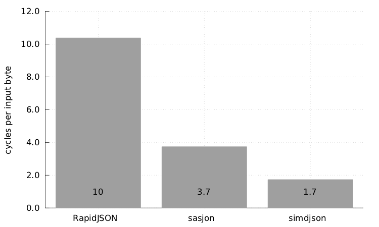
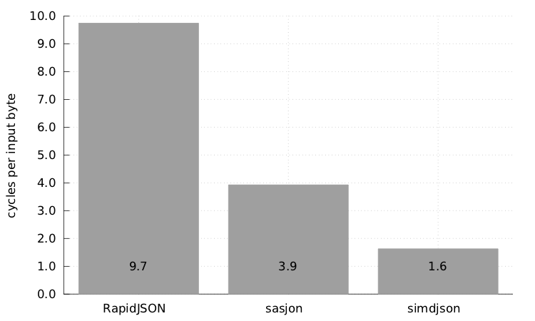
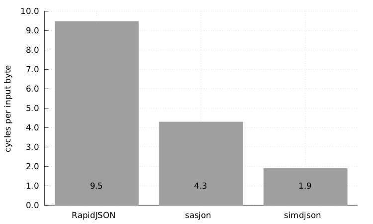
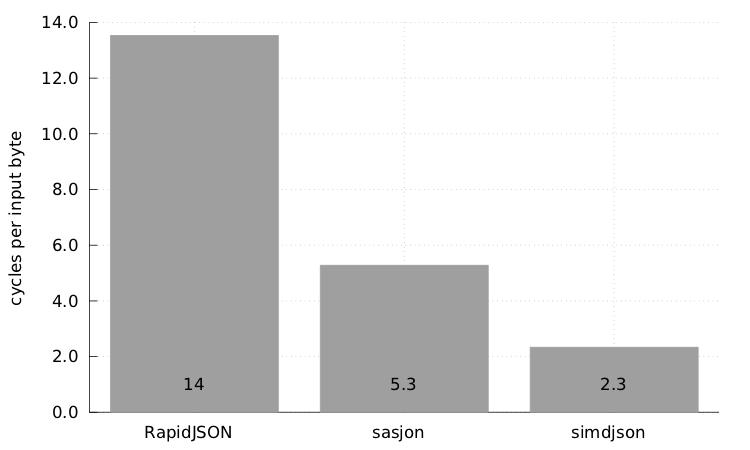

# simdjson : Parsing gigabytes of JSON per second

A C++  library to see how fast we can parse JSON with complete validation.

Goal: Speed up the parsing of JSON per se.

## Requirements

- Linux or macOS (currently)
- A recent C++ compiler (e.g., GNU GCC or LLVM CLANG)
- Bash (for benchmark scripts)

## Some performance results

We present the time (in cycles per input byte) needed to fully parse a JSON file (with error checking) and to collect some statistics about the document (e.g., the number of integers), for some JSON files. For these tests, we use an Intel processor with a Skylake microarchitecture. All results are single-threaded.

apache_builds.json:



github_events.json:



twitter.json:



update-center.json:




## Code example

```C
#include "simdjson/jsonparser.h"

/...

const char * filename = ... //

// use whatever means you want to get a string of you JSON document
std::string_view p = get_corpus(filename);
ParsedJson pj;
pj.allocateCapacity(p.size()); // allocate memory for parsing up to p.size() bytes
bool is_ok = json_parse(p, pj); // do the parsing, return false on error
// parsing is done!
// You can safely delete the string content
free((void*)p.data());
// the ParsedJson document can be used here
// js can be reused with other json_parse calls.
```

It is also possible to use a simplier API if you do not mind having the overhead
of memory allocation with each new JSON document:

```C
#include "simdjson/jsonparser.h"

/...

const char * filename = ... //
std::string_view p = get_corpus(filename);
ParsedJson pj = build_parsed_json(p); // do the parsing
// you no longer need p at this point, can do free((void*)p.data())
if( ! pj.isValid() ) {
    // something went wrong
}
```


## Usage

Requirements:  clang or gcc and make. A system like Linux or macOS is expected.

To test:

```
make
make test
```


To run benchmarks:
```
make parse
./parse jsonexamples/twitter.json
```
Under Linux, the `parse` command gives a detailed analysis of the performance counters.

To run comparative benchmarks (with other parsers):

```
make benchmark
```


## Tools

- `json2json mydoc.json` parses the document, constructs a model and then dumps back the result to standard output.
- `json2json -d mydoc.json` parses the document, constructs a model and then dumps model (as a tape) to standard output. The tape format is described in the accompanying file `tape.md`.
- `minify mydoc.json` minifies the JSON document, outputting the result to standard output. Minifying means to remove the unneeded white space charaters.

## Scope

We provide a fast parser. It fully validates the input according to the various specifications.
The parser builds a useful immutable (read-only) DOM (document-object model) which can be later accessed.

To simplify the engineering, we make some assumptions.

- We support UTF-8 (and thus ASCII), nothing else (no Latin, no UTF-16). We do not believe that this is a genuine limitation in the sense that we do not think that there is any serious application that needs to process JSON data without an ASCII or UTF-8 encoding.
- We assume AVX2 support which is available in all recent mainstream x86 processors produced by AMD and Intel. No support for non-x86 processors is included though it can be done. We plan to support ARM processors (help is invited).
- We only support GNU GCC and LLVM Clang at this time. There is no support for Microsoft Visual Studio, though it should not be difficult (help is invited).
- In cases of failure, we just report a failure without any indication as to the nature of the problem. (This can be easily improved without affecting performance.)
- As allowed by the specification, we allow repeated keys within an object (other parsers like sajson do the same).

*We do not aim to provide a general-purpose JSON library.* A library like RapidJSON offers much more than just parsing, it helps you generate JSON and offers various other convenient functions. We merely parse the document.


## Features

- The input string is unmodified. (Parsers like sajson and RapidJSON use the input string as a buffer.)
- We parse integers and floating-point numbers as separate types which allows us to support large 64-bit integers in [-9223372036854775808,9223372036854775808), like a Java `long` or a C/C++ `long long`. Among the parsers  that differentiate between integers and floating-point numbers, not all support 64-bit integers. (For example, sajson rejects JSON files with integers larger than or equal to 2147483648. RapidJSON will parse a file containing an overly long integer like 18446744073709551616 as a floating-point number.) When we cannot represent exactly an integer as a signed 64-bit value, we reject the JSON document.
- We do full UTF-8 validation as part of the parsing. (Parsers like fastjson, gason and dropbox json11 do not do UTF-8 validation.)
- We fully validate the numbers. (Parsers like gason and ultranjson will accept `[0e+]` as valid JSON.)
- We validate string content for unescaped characters. (Parsers like fastjson and ultrajson accept unescaped line breaks and tags in strings.)

## Architecture

The parser works in three stages:

- Stage 1. Identifies quickly structure elements, strings, and so forth. We validate UTF-8 encoding at that stage.
- Stage 2. Involves the "flattening" of the data from stage 1, that is, convert bitsets into arrays of indexes.
- Stage 3. (Structure building) Involves constructing a "tree" of sort to navigate through the data. Strings and numbers are parsed at this stage.


## Navigating the parsed document

Here is a code sample to dump back the parsed JSON to a string:

```c
    ParsedJson::iterator pjh(pj);
    if (!pjh.isOk()) {
      std::cerr << " Could not iterate parsed result. " << std::endl;
      return EXIT_FAILURE;
    }
    compute_dump(pj);
    //
    // where compute_dump is :

void compute_dump(ParsedJson::iterator &pjh) {
  if (pjh.is_object()) {
    std::cout << "{";
    if (pjh.down()) {
      pjh.print(std::cout); // must be a string
      std::cout << ":";
      pjh.next();
      compute_dump(pjh); // let us recurse
      while (pjh.next()) {
        std::cout << ",";
        pjh.print(std::cout);
        std::cout << ":";
        pjh.next();
        compute_dump(pjh); // let us recurse
      }
      pjh.up();
    }
    std::cout << "}";
  } else if (pjh.is_array()) {
    std::cout << "[";
    if (pjh.down()) {
      compute_dump(pjh); // let us recurse
      while (pjh.next()) {
        std::cout << ",";
        compute_dump(pjh); // let us recurse
      }
      pjh.up();
    }
    std::cout << "]";
  } else {
    pjh.print(std::cout); // just print the lone value
  }
}
```

The following function will find all user.id integers:

```C
void simdjson_traverse(std::vector<int64_t> &answer, ParsedJson::iterator &i) {
  switch (i.get_type()) {
  case '{':
    if (i.down()) {
      do {
        bool founduser = equals(i.get_string(), "user");
        i.next(); // move to value
        if (i.is_object()) {
          if (founduser && i.move_to_key("id")) {
            if (i.is_integer()) {
              answer.push_back(i.get_integer());
            }
            i.up();
          }
          simdjson_traverse(answer, i);
        } else if (i.is_array()) {
          simdjson_traverse(answer, i);
        }
      } while (i.next());
      i.up();
    }
    break;
  case '[':
    if (i.down()) {
      do {
        if (i.is_object_or_array()) {
          simdjson_traverse(answer, i);
        }
      } while (i.next());
      i.up();
    }
    break;
  case 'l':
  case 'd':
  case 'n':
  case 't':
  case 'f':
  default:
    break;
  }
}
```


## Various References

- [Google double-conv](https://github.com/google/double-conversion/)
- [How to implement atoi using SIMD?](https://stackoverflow.com/questions/35127060/how-to-implement-atoi-using-simd)
- [Parsing JSON is a Minefield 💣](http://seriot.ch/parsing_json.php)
- https://tools.ietf.org/html/rfc7159
- The Mison implementation in rust  https://github.com/pikkr/pikkr
- http://rapidjson.org/md_doc_sax.html
- https://github.com/Geal/parser_benchmarks/tree/master/json
- Gron: A command line tool that makes JSON greppable https://news.ycombinator.com/item?id=16727665
- GoogleGson https://github.com/google/gson
- Jackson https://github.com/FasterXML/jackson
- https://www.yelp.com/dataset_challenge
- RapidJSON. http://rapidjson.org/

Inspiring links:
- https://auth0.com/blog/beating-json-performance-with-protobuf/
- https://gist.github.com/shijuvar/25ad7de9505232c87034b8359543404a
- https://github.com/frankmcsherry/blog/blob/master/posts/2018-02-11.md


Validating UTF-8 takes no more than 0.7 cycles per byte:
- https://github.com/lemire/fastvalidate-utf-8 https://lemire.me/blog/2018/05/16/validating-utf-8-strings-using-as-little-as-0-7-cycles-per-byte/


## Remarks on JSON parsing

- The JSON spec defines what a JSON parser is:
>  A JSON parser transforms a JSON text into another representation.  A JSON parser MUST accept all texts that conform to the JSON grammar.  A JSON parser MAY accept non-JSON forms or extensions. An implementation may set limits on the size of texts that it accepts.  An implementation may set limits on the maximum depth of nesting.  An implementation may set limits on the range and precision of numbers.  An implementation may set limits on the length and character contents of strings."


- JSON is not JavaScript:
> All JSON is Javascript but NOT all Javascript is JSON. So {property:1} is invalid because property does not have double quotes around it. {'property':1} is also invalid, because it's single quoted while the only thing that can placate the JSON specification is double quoting. JSON is even fussy enough that {"property":.1} is invalid too, because you should have of course written {"property":0.1}. Also, don't even think about having comments or semicolons, you guessed it: they're invalid. (credit:https://github.com/elzr/vim-json)

- The  structural characters are:


      begin-array     =  [ left square bracket
      begin-object    =  { left curly bracket
      end-array       =  ] right square bracket
      end-object      =  } right curly bracket
      name-separator  = : colon
      value-separator = , comma


### Pseudo-structural elements

A character is pseudo-structural if and only if:

1. Not enclosed in quotes, AND
2. Is a non-whitespace character, AND
3. It's preceding chararacter is either:
(a) a structural character, OR
(b) whitespace.

This helps as we redefine some new characters as pseudo-structural such as the characters 1, 1, G, n in the following:

> { "foo" : 1.5, "bar" : 1.5   GEOFF_IS_A_DUMMY bla bla , "baz", null }


## Academic References

- T.Mühlbauer, W.Rödiger, R.Seilbeck, A.Reiser, A.Kemper, and T.Neumann. Instant loading for main memory databases. PVLDB, 6(14):1702–1713, 2013. (SIMD-based CSV parsing)
- Mytkowicz, Todd, Madanlal Musuvathi, and Wolfram Schulte. "Data-parallel finite-state machines." ACM SIGARCH Computer Architecture News. Vol. 42. No. 1. ACM, 2014.
- Lu, Yifan, et al. "Tree structured data processing on GPUs." Cloud Computing, Data Science & Engineering-Confluence, 2017 7th International Conference on. IEEE, 2017.
- Sidhu, Reetinder. "High throughput, tree automata based XML processing using FPGAs." Field-Programmable Technology (FPT), 2013 International Conference on. IEEE, 2013.
- Dai, Zefu, Nick Ni, and Jianwen Zhu. "A 1 cycle-per-byte XML parsing accelerator." Proceedings of the 18th annual ACM/SIGDA international symposium on Field programmable gate arrays. ACM, 2010.
- Lin, Dan, et al. "Parabix: Boosting the efficiency of text processing on commodity processors." High Performance Computer Architecture (HPCA), 2012 IEEE 18th International Symposium on. IEEE, 2012. http://parabix.costar.sfu.ca/export/1783/docs/HPCA2012/final_ieee/final.pdf
- Deshmukh, V. M., and G. R. Bamnote. "An empirical evaluation of optimization parameters in XML parsing for performance enhancement." Computer, Communication and Control (IC4), 2015 International Conference on. IEEE, 2015.
- Moussalli, Roger, et al. "Efficient XML Path Filtering Using GPUs." ADMS@ VLDB. 2011.
- Jianliang, Ma, et al. "Parallel speculative dom-based XML parser." High Performance Computing and Communication & 2012 IEEE 9th International Conference on Embedded Software and Systems (HPCC-ICESS), 2012 IEEE 14th International Conference on. IEEE, 2012.
- Li, Y., Katsipoulakis, N.R., Chandramouli, B., Goldstein, J. and Kossmann, D., 2017. Mison: a fast JSON parser for data analytics. Proceedings of the VLDB Endowment, 10(10), pp.1118-1129. http://www.vldb.org/pvldb/vol10/p1118-li.pdf
- Cameron, Robert D., et al. "Parallel scanning with bitstream addition: An xml case study." European Conference on Parallel Processing. Springer, Berlin, Heidelberg, 2011.
- Cameron, Robert D., Kenneth S. Herdy, and Dan Lin. "High performance XML parsing using parallel bit stream technology." Proceedings of the 2008 conference of the center for advanced studies on collaborative research: meeting of minds. ACM, 2008.
- Shah, Bhavik, et al. "A data parallel algorithm for XML DOM parsing." International XML Database Symposium. Springer, Berlin, Heidelberg, 2009.
- Cameron, Robert D., and Dan Lin. "Architectural support for SWAR text processing with parallel bit streams: the inductive doubling principle." ACM Sigplan Notices. Vol. 44. No. 3. ACM, 2009.
- Amagasa, Toshiyuki, Mana Seino, and Hiroyuki Kitagawa. "Energy-Efficient XML Stream Processing through Element-Skipping Parsing." Database and Expert Systems Applications (DEXA), 2013 24th International Workshop on. IEEE, 2013.
- Medforth, Nigel Woodland. "icXML: Accelerating Xerces-C 3.1. 1 using the Parabix Framework." (2013).
- Zhang, Qiang Scott. Embedding Parallel Bit Stream Technology Into Expat. Diss. Simon Fraser University, 2010.
- Cameron, Robert D., et al. "Fast Regular Expression Matching with Bit-parallel Data Streams."
- Lin, Dan. Bits filter: a high-performance multiple string pattern matching algorithm for malware detection. Diss. School of Computing Science-Simon Fraser University, 2010.
- Yang, Shiyang. Validation of XML Document Based on Parallel Bit Stream Technology. Diss. Applied Sciences: School of Computing Science, 2013.
-  N. Nakasato, "Implementation of a parallel tree method on a GPU", Journal of Computational Science, vol. 3, no. 3, pp. 132-141, 2012.
